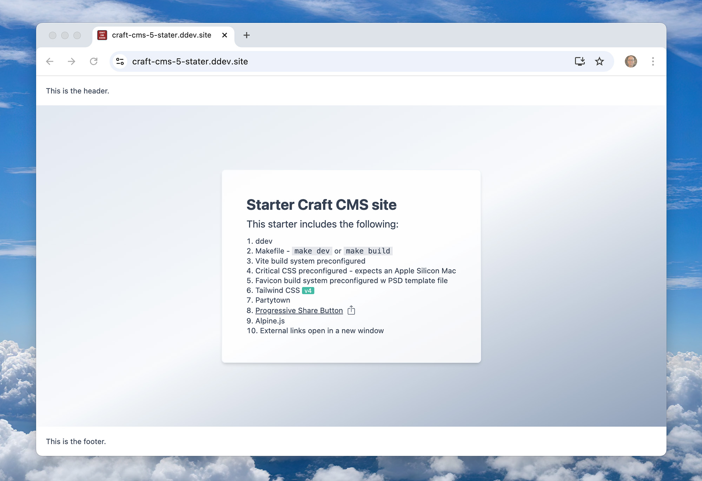

# Craft CMS 5 Starter Kit

This is an always-a-WIP starter project for Craft CMS.

The installation process is **heavily inspired** by [Craft CMS 4 Starter Kit](https://github.com/onedarnleyroad/craftcms) by [onedarnleyroad](https://www.onedarnleyroad.com/).



## Features

This starter includes the following pre-configured features:

1. ddev - for local development
2. Makefile - make dev or make build
3. Vite build system preconfigured
4. Critical CSS preconfigured - expects an Apple Silicon Mac
5. Favicon build system preconfigured w PSD template file
6. Tailwind CSS v4
7. Partytown
8. Progressive Share Button
9. Alpine.js
10. External links open in a new window

## Installation

### With Git CLI

You can clone the repo via the Git CLI:

```shell
git clone git@github.com:johnfmorton/craft-cms-ddev-starter.git PATH
```

Make sure that `PATH` is a **new** _or_ **existing and empty** folder.

Next, you'll want to discard the existing `/.git` directory. In the terminal, run:

```shell
cd PATH
rm -rf .git
```

Last, clean up and set some default files for use:

```shell
cp .env.example.dev .env
mv -f composer.json.default composer.json
mv -f .gitignore.default .gitignore
rm CHANGELOG.md && rm LICENSE.md && rm README.md
```

## Configuring DDEV

_Note: This section is optional. If you are simply test-driving this project, feel free to skip to the next section. ⚡_

To configure your project to operate on a domain other than `https://craftcms.ddev.site`, run:

```shell
ddev config
```

Follow the prompts.

- **Project name:** e.g. `mysite` would result in a project URL of `https://mysite.ddev.site` (make note of this for later in the installation process)
- **Docroot location:** defaults to `web`, keep as-is
- **Project Type:** defaults to `php`, keep as-is

## Installing Craft

To install a clean version of Craft, run:

```shell
make install
```

Follow the prompts.

This command will:

1. Copy your local SSH keys into the container (handy if you are setting up [craft-scripts](https://github.com/nystudio107/craft-scripts/))
2. Start your DDEV project
3. Install Composer
4. Install npm
5. Do a one-time build of Vite
6. Generate `APP_ID` and save to your `.env` file
7. Generate `SECURITY_KEY` and save to your `.env` file
8. Installing Craft for the first time, allowing you to set the admin's account credentials
9. Install all Craft plugins

Once the process is complete, type `ddev launch` to open the project in your default browser. 🚀

## Local development with Vite

To begin development with Vite's dev server & HMR, run:

```shell
make dev
```


## TO DO - but not working yet

## Installing with composer

### Option 1: With Composer (recommended)

If you have [Composer](https://getcomposer.org/) installed on your local machine,
you can use `create-project` to pull the latest tagged release.

Open terminal prompt, and run:

```shell
composer create-project johnfmorton/craft-cms-ddev-starter PATH --no-install
```

Make sure that `PATH` is a **new** or **existing and empty** folder.
